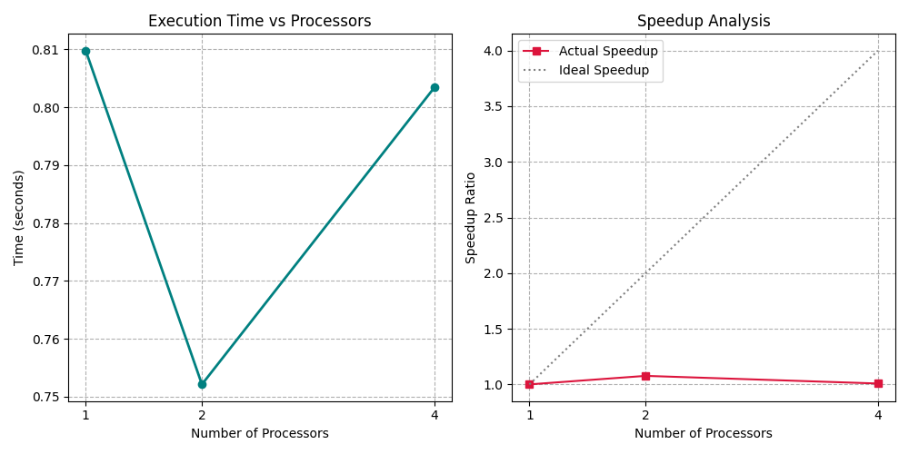
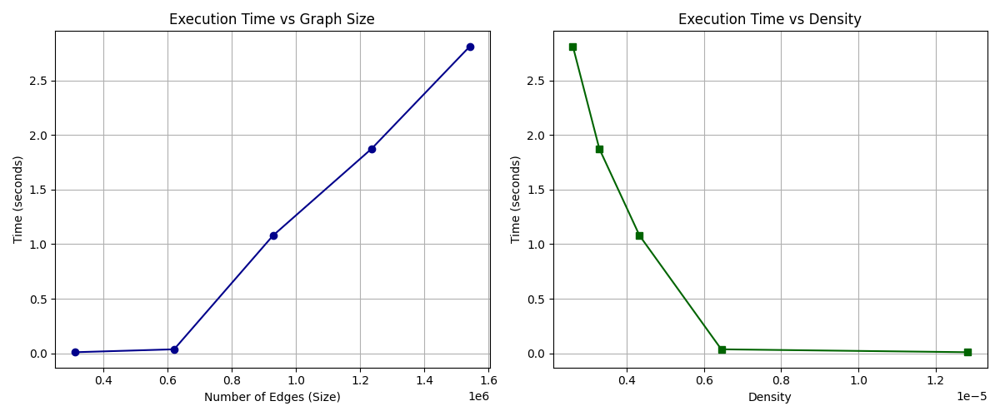
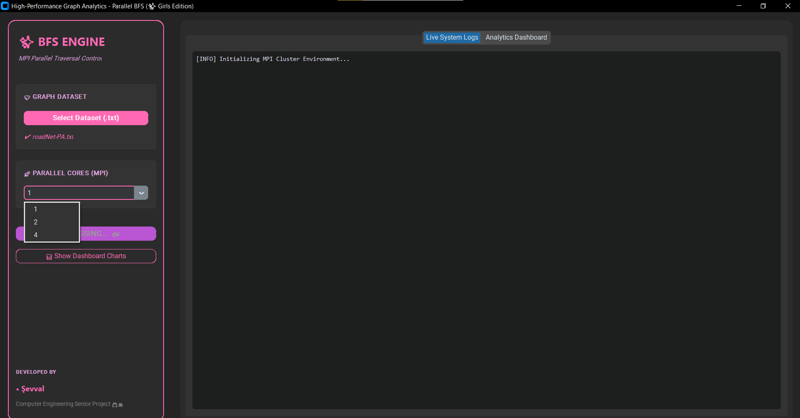

# ⚡ Parallel BFS Graph Analysis using MPI

Performance Analysis of Sequential and Parallel Breadth-First Search on Large-Scale Graphs

---

## 📊 Project Overview

This project implements and analyzes the **Breadth-First Search (BFS)** algorithm using both **sequential** and **parallel** approaches. The parallel implementation is developed with **MPI (Message Passing Interface)** using **mpi4py**, enabling distributed execution across multiple processes.

The project evaluates the impact of graph size, graph density, communication overhead, and processor count on BFS performance using a real-world road network dataset from the **Stanford Network Analysis Project (SNAP)**.

---



---

## ✨ Features

- ⚡ Sequential Breadth-First Search implementation
- 🚀 Parallel BFS implementation using MPI (mpi4py)
- 📊 Performance comparison between sequential and parallel execution
- 📈 Complexity analysis on different graph sizes
- 📉 Speedup and scalability evaluation
- 🌐 Graph processing using NetworkX
- 🖥️ Graphical User Interface (GUI) for running experiments
- 📑 Automatic visualization of experimental results

---

## 🛠️ Technologies

| Category | Technologies |
|-----------|--------------|
| Programming Language | Python |
| Parallel Programming | MPI, mpi4py |
| Graph Library | NetworkX |
| Visualization | Matplotlib |
| GUI | CustomTkinter |
| Dataset | SNAP Road Network Dataset |
| Development Environment | Visual Studio Code |

---

## 🎯 Project Objectives

The primary objectives of this project are:

- Understand the behavior of the Breadth-First Search algorithm on large-scale graphs.
- Compare sequential and parallel BFS implementations.
- Measure execution time, scalability, and speedup.
- Analyze communication overhead introduced by MPI.
- Evaluate how graph size and graph density affect overall performance.
---

## 🧠 Algorithm Overview

Breadth-First Search (BFS) is a fundamental graph traversal algorithm that explores all neighboring vertices level by level before moving to the next depth. It guarantees the shortest path in unweighted graphs and is widely used in graph analytics, networking, and routing applications.

This project includes both:

- **Sequential BFS** for baseline performance measurement.
- **Parallel BFS** implemented with MPI to distribute workload across multiple processes.

---

## ⚡ Parallelization Strategy

The parallel implementation uses **MPI (Message Passing Interface)** through the **mpi4py** library.

The overall workflow is:

1. Load the graph dataset.
2. Divide the frontier among available MPI processes.
3. Traverse local vertices in parallel.
4. Synchronize newly discovered nodes using MPI communication.
5. Merge frontiers for the next BFS level.
6. Continue until all reachable vertices are visited.

Although multiple processes execute simultaneously, communication and synchronization introduce additional overhead, especially as the number of processes increases.

---

## 📂 Dataset

This project uses the **Pennsylvania Road Network (roadNet-PA)** dataset from the **Stanford Network Analysis Project (SNAP)**.

Dataset characteristics:

| Property | Value |
|----------|------:|
| Nodes | 1,088,092 |
| Edges | 1,541,898 |
| Graph Type | Undirected |
| Average Degree | 2.83 |

> **Note:**  
> The dataset is not included in this repository because of its large size.

It can be downloaded from:

https://snap.stanford.edu/data/roadNet-PA.html

---

## 📈 Performance Analysis

The project compares sequential and parallel BFS implementations by measuring:

- Execution time
- Graph scalability
- Speedup
- Communication overhead
- Effect of graph density
- Processor utilization

The experiments were performed using different graph sizes and multiple MPI process counts to evaluate scalability.



---

## 📊 Key Findings

- Larger graphs increased traversal time for both sequential and parallel implementations.
- Parallel execution reduced computation time for moderate workloads.
- Increasing the number of MPI processes did not always improve performance because of synchronization and communication overhead.
- The best performance improvement was achieved before communication costs became dominant.
- Graph density significantly influenced traversal efficiency.
---

## 📁 Project Structure

```
Parallel-BFS-Graph-Analysis
│
├── README.md
├── LICENSE
├── .gitignore
├── requirements.txt
│
├── docs
│   ├── performance-analysis.png
│   └── complexity-analysis.png
│
├── analyze_complexity.py
├── parallel_bfs.py
├── plot_results.py
├── gui_app.py
└── test.py
```

---

## 🚀 Getting Started

### 1. Clone the Repository

```bash
git clone https://github.com/sevvalsevim/Parallel-BFS-Graph-Analysis.git
```

---

### 2. Install Dependencies

```bash
pip install -r requirements.txt
```

---

### 3. Download the Dataset

This project uses the **roadNet-PA** dataset from SNAP.

Download it from:

https://snap.stanford.edu/data/roadNet-PA.html

Place the downloaded dataset inside the project directory before running the application.

---

### 4. Run the Sequential Version

```bash
python parallel_bfs.py
```

---

### 5. Run the Parallel Version

Example using 4 MPI processes:

```bash
mpiexec -n 4 python parallel_bfs.py
```

---

### 6. Launch the GUI

```bash
python gui_app.py
```
The graphical interface is built using **CustomTkinter**, providing a modern and user-friendly desktop experience for configuring BFS experiments and visualizing results.
---

## 📸 Screenshots

### Performance Analysis

> Replace with your graph image.

```markdown

```

---

### Complexity Analysis

> Replace with your graph image.

```markdown

```

---

### GUI Interface

> Replace with a screenshot of the graphical interface.

```markdown

```

---

## 💡 Future Improvements

Potential enhancements include:

- Distributed graph partitioning for improved scalability.
- Dynamic workload balancing among MPI processes.
- Support for weighted graph traversal algorithms.
- Performance evaluation on multi-node cluster environments.
- Additional graph algorithms such as DFS, Dijkstra, and PageRank.

---

## 📄 License

This project is licensed under the MIT License.

---

## 👩‍💻 Author

**Şevval Sevim**

Computer Engineering Graduate (English Program)

GitHub:

https://github.com/sevvalsevim

---

⭐ If you found this project interesting, consider giving it a star on GitHub.